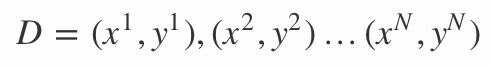

数据-计算广告基础
===

目录
---
<!-- TOC -->

- [线性回归](#线性回归)
- [行业与生态](#行业与生态)
- [商业模式](#商业模式)

逻辑回归（Logistic Regression）是机器学习中的一种分类模型，在实际中应用非常广泛。在工业界，逻辑回归简单易部署的特性使其非常受欢迎，很多公司的CTR模型实际上就是一个上亿维度稀疏表达特征的LR模型，逻辑回归模型可以依靠特征工程来不断优化，可解释性较强，相关技术也比较成熟。说道逻辑回归，我们首先得从线性回归开始。
## 逻辑回归
### 问题
实际工作中，我们可能会遇到如下问题：
- 预测一个用户是否点击特定的商品
- 判断用户的性别
- 预测用户是否会购买给定的品类
- 判断一条评论是正面的还是负面的

这些都可以看做是分类问题，更准确地，都可以看做是二分类问题。同时，这些问题本身对美团也有很重要的价值，能够帮助我们更好的了解我们的用户，服务我们的用户。要解决这些问题，通常会用到一些已有的分类算法，比如逻辑回归，或者支持向量机。它们都属于有监督的学习，因此在使用这些算法之前，必须要先收集一批标注好的数据作为训练集。有些标注可以从log中拿到（用户的点击，购买），有些可以从用户填写的信息中获得（性别），也有一些可能需要人工标注（评论情感极性）。另一方面，知道了一个用户或者一条评论的标签后，我们还需要知道用什么样的特征去描述我们的数据，对用户来说，可以从用户的浏览记录和购买记录中获取相应的统计特征，而对于评论来说，最直接的则是文本特征。这样拿到数据的特征和标签后，就得到一组训练数据：

其中 xi 是一个 m 维的向量，xi=[xi1,xi2,…,xim] ，y 在 {0, 1} 中取值。（本文用{1，0}表示正例和负例，后文沿用此定义。）

我们的问题可以简化为，如何找到这样一个决策函数y∗=f(x)，它在未知数据集上能有足够好的表现。至于如何衡量一个二分类模型的好坏，我们可以用分类错误率这样的指标：Err=1N∑1[y∗=y] 。也可以用准确率，召回率，AUC等指标来衡量。

值得一提的是，模型效果往往和所用特征密切相关。特征工程在任何一个实用的机器学习系统中都是必不可少的，机器学习InAction系列已有一篇文章中对此做了详细的介绍，本文不再详细展开。

