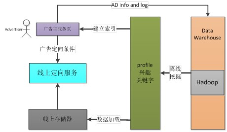

业务背景-计算广告基础
===

目录
---
<!-- TOC -->

- [广告定向方式](#广告定向方式)
- [广告定向方式对比](#广告定向方式对比)
- [广告定向方式数据生成](#广告定向方式数据生成)
- [广告定向线上架构](#广告定向线上架构)

所谓定向，就是广告算法工程师提供给广告主一些用户属性与条件，供广告主用来找到自己的目标人群的。

定向是很重要的，在古代，一个买大饼的武大郎，想必不会把大饼担挑到几十公里见不到人的戈壁滩去吆喝。一个卖草帽的老板，也不会跑到青楼一条街去吆喝。定向就是广告主选择自己的目标人群，避免造成“你喊啊，你喊破喉咙也没人理你”的尴尬场面。

这个功能可大可小，随便做做点简单的也许，好好做得很细也行，对小公司来说，投入产出比不见得会特别高，对大公司来说，可以投入大量人力来好好做，体现大公司风范。

在这个方面，机器学习的各种方法都可以用上，甚至可以不择手段。

为了能看到全面点的东西，先抄些别人总结的东西来吧，其实组内也没有做出这么多定向条件来。抄完后就说点自己组内做的。

下面的内容来自腾讯广点通的技术博客“火光摇曳”中的《细数广告定向》。

### 广告定向方式
常见的广告定向方式有以下几种。
1. 人群属性定向（Demographic Targeting）基于用户基本属性，如年龄、性别、教育背景、职业、婚姻状态、收入、消费能力、工作场所等做人群定向，相对静态，长期不变。
2. 上下文定向（Contextual Targeting）基于用户当前查询的query、浏览的网页、使用的 App 等语义分析结果定向，均为实时访问上下文。另外，有些人喜欢把移动设备、LBS 地点、天气也归入此类，个人更倾向于特指内容型数据，如文本、视频等。常见的定向属性有关键词（Google Adsense、Facebook、百度凤巢）、否定关键词（Google Adsense）、展示 URL（Google Adsense、百度网盟）、页面主题（Google Adsense）、行业分类（百度网盟）等。
3. 行为定向（Behavioral Targeting）基于用户历史行为数据挖掘用户兴趣，行为数据如网页浏览、网页点击、查询 query、UGC 内容（如微博、朋友圈等），一般需要区分长期、短期和实时兴趣。常见的定向属性就是兴趣爱好，依靠人工定义一套层次化的类别体系，有些平台还会按照时间段（Google Adsense、百度网盟）或者商业性（品友互动）进一步区分。
4. 再营销（Remarketing）常见的有到访再营销、搜索再营销、广告点击再营销等。其中，到访再营销需要用户访问过商品页面或者在商品页发生过某种预定义的行为（如收藏、下单、转发等），在广告投放时，广告平台为用户展示相同（直接查表）或类似（item-based、content-based）的商品；搜索再营销根据用户在搜索引擎中搜过的 query，在广告联盟网站上展示内容相关的广告；广告点击再营销则是依据用户点击的广告数据，为其展示相同或类似的广告。一般实时性要求高，效果好，但是用户覆盖少。
5. 相似用户定向（Look-Alike Targeting）侧重基于确定的一小波人群，圈出更大规模类似的人群，保证定向效果的同时，扩大用户覆盖。因为挖掘相似用户过程中，主要依据用户基本属性或兴趣（长期），更新频率不高。Google Adsense 将曾经到访过广告页面的用户作为基准定制人群，然后按照用户在 Google Display Network 上的页面访问行为衡量用户之间的相似性，以扩展更多用户；而 Facebook 需要广告主提交基准定制人群，比如 Email、Phone、Facebook Ids、App Ids，后台自动找到相似用户。这块工作和 DSP 中的 audienceselection 非常类似。
6. 地理位置定向（Geo Targeting）移动互联网比较热门的定向，可以定位城市、商圈、学校等区域。
7. 其他
    - 时间定向（TimeTargeting）：一天中的不同时间段。
    - 设备定向（DeviceTargeting）：如手机品牌、型号，操作系统，运营商等。
    - 天气定向（WeatherTargeting）：对经常出现雾霾天气的北京，投放口罩、空气清新器应该是靠谱的。
    - 语言定向（LanguageTargeting）：一般具有国际化市场的广告平台会提供，如 Google、Facebook。

### 广告定向方式对比
按照用户覆盖和定向效果两个维度，综合考量不同定向方式之间的关系，如下图所示：

广告定向对比

横坐标是覆盖率，纵坐标是效果。不同类型的定向条件，效果不一样，覆盖率也不一样，如remareting，覆盖率低，但效果很好。

### 广告定向方式数据生成
上面说的那么多定向方式，一个公司全部实现的非常难，这里挑几个组内实现过的来说。

简单的，在多数的平台上，性别用户都会自己填，手机平台或者PC能从前端直接取到，根据日志再统计一下就够了。

下面说些需要做点工作的。

1. 年龄

    年龄很重要，广告主很需要。对于一个平台来说，有部分年龄是可以准确获取到的。

    还有很多未知年龄的用户，可以跟这个用户的好友，做一个平均值，这样，很多用户就有了年龄，这个方法虽然很简单，却很凑效，其他看来不少paper，倒也没发现哪个更靠谱了。

2. 兴趣

    基于用户历史行为数据挖掘用户兴趣。

    首先要做的工作是定义兴趣，对于媒体来说，简单的方式就是用网页（频道）来定义。

    每个网页一般会打一些标签，简单的可以通过运营团队给这些网页（频道）标一些商业相关的兴趣标签（这个可以使用机器学习方法自己来搞，就是统计看每个频道的用户对各类广告的点击率，广告自己是有商业相关信息的，那么就能得到了各个频道跟各个兴趣的相关度，就把这些相关度作为这个频道的兴趣向量）。

    网页被定义兴趣标签后（机器学习挖掘出来的是向量），用户会在平台上浏览一些网页，就直接把这个网页代表的兴趣标签（或者是向量）分给这个用户。计算一个用户的兴趣时，就把他最近一段时间看过的网页的兴趣向量累加（标签就用one hot表示），当然要对时间做一些衰减，很多天前看的，兴趣会被减弱，权重小点；最近几天看的，这个权重就大点。

    这样用户就有了一个兴趣向量，再根据一些归一化的方法，把兴趣向量归一成一个全局的，就得到了用户兴趣向量，然后根据阈值选取，就得到了用户的兴趣。

3. 关键字

    跟兴趣类似，首先对网页分词，得到每个网页的词。利用topic model选择topic 明显的优质词，再根据运营或者某些方法得到的一批的商业词（跟广告主有半毛钱关系的词），过滤每个网页的里面的商业词，得到了每个网页都用若干个商业词表示。

    计算一个用户的关键词时，就把他最近一段时间看过的网页的商业词分给该用户。

    分完后每个用户都有了一大堆的关键词（有可能重复），利用tf-idf对每个关键词都弄出个权重来，再根据阈值选取，就得到了用户的关键词。

4. 指定页面用户

    用户会浏览过很多网页，其中有些是广告主的主页。

    这里就可以来些大招了——word2vec。用户浏览过的网页可以用一个id表示，那么每个用户就有了一串的id（表示这个用户浏览过的网页），把这串id当作一句话。那么多个用户的浏览记录，就有了多句话。这么多句话，就能作为word2vec的输入了，等word2vec算法跑完，每个网页id就有了一个向量来表示了。

    每个id的向量本身每一维没啥意义（目前找不出来），只有他们的距离有意义。

    广告主过来下单的时候，哪个页面跟这个广告主的主页最接近能计算出来的，那么就可以事先计算好每个广告主最相似的页面，这时展示给广告主一些勾选项，让广告主选择指定浏览过某页面的用户投放。

    这就是指定页面用户定向条件的挖掘方法，想看多点的话看另一组word2vec的博文的应用篇。、
    
### 广告定向线上架构

经过广告算法工程师的工作，利用数据仓库和集群计算，离线完成用户的定向条件的挖掘后，其他团队会根据数据建立索引。

当广告主过来下单的时候，可以查询他的定向条件覆盖的人数以及历史售卖情况，根据这些信息广告主进行出价和下单。

广告主下单后会建立广告计划，广告计划以及定向条件会加载到存储器。

离线挖掘好的用户定向条件也会加载到线上存储器。一个用户过来后，线上服务会查询广告计划的定向条件，也会查询用户的profile，根据这两个东西的匹配来筛选适合投给这个用户的广告计划。

然后剩下的就是算分排序，扣费等等事情了。后面的博文会讨论。

致谢

多位互联网博主如@Rickjin等。