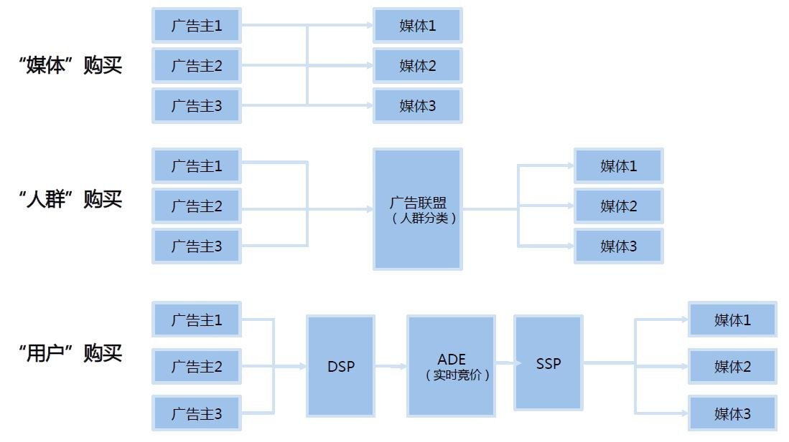
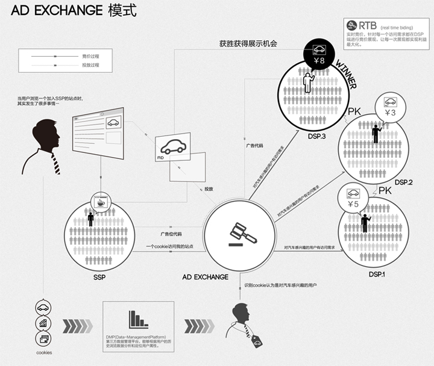
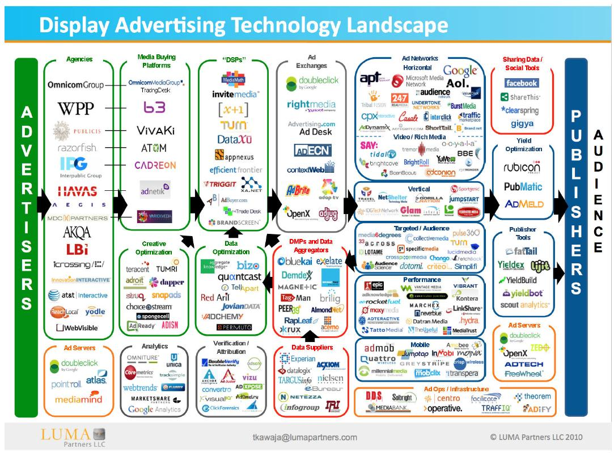
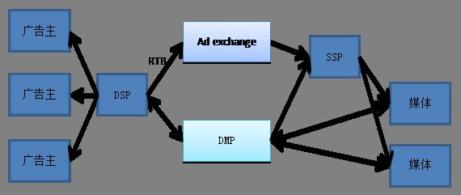
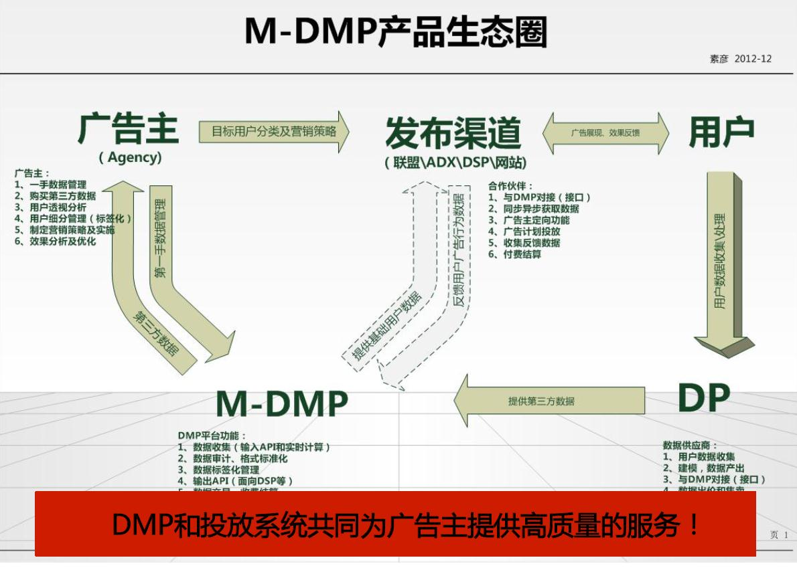

生态圈-计算广告基础
===

目录
---
<!-- TOC -->

- [互联网广告生态圈发展过程](#互联网广告生态圈发展过程)
    - [基本情况](#基本情况)
    - [产业情况](#产业情况)
    - [工业情况](#工业情况)
- [互联网广告生态圈的一些解读](#互联网广告生态圈的一些解读)
- [大数据下的互联网广告新发展](#大数据下的互联网广告新发展)
	- [广告技术生态及DMP所处位置](#广告技术生态及DMP所处位置)
- [参考文献](#参考文献)

互联网广告是互联网行业最主要的赢利模式，流量变现成为互联网商业产品非常重要的评价标准。
随着互联网的发展，互联网的流量也是越来越大，2013上半年互联网广告投放总额达431亿元，可以预计，互联网广告的投放很快就会达到千亿元的标准。
如此一个巨大的市场，自然能吸引众多的资本家向往，从而产生了一个互联网广告产业。
随着互联网人群定向技术的发展，互联网广告也开始摆脱单一、古板的交易模式，转而向更精确高效的交易模式转变。

## 互联网广告生态圈发展过程
### 基本情况
从互联网广告业的发展过程说起。
先看下面的图吧。

其中广告主是那些有广告投放需求的人，也可以认为是广告代理商。事实上，他们一开始也是有广告投放需求的人，但是后来这个工作太繁杂，就专门请了代理商过来做。
媒体指的是有流量的公司，如各大门户网站，各种论坛。

互联网广告的发展经历了下面几个阶段：
1. “媒体”购买阶段，广告主直接跟媒体谈判，买流量。这个工作是比较繁杂的，媒体很多，广告主需要跟很多类型的媒体谈判；另一方面，媒体也要跟多个广告主谈判，生意做起来比较复杂。
2. 是“人群”购买阶段，上面的情况经过一段时间，就出现了类似广告中介之类的皮包公司，就是跟广告主商量：给我钱，我帮你搞定，甚至可以包办设计广告，找媒体并投放等工作的公司。随着这些公司的发展，就出现了类似广告联盟（AdNetworks）的公司，广告主把需求提出来，媒体把自己的流量承包给联盟，广告联盟把媒体的人群分类后，根据广告主的需求匹配相应的用户群体。这样的模式对广告联盟的营销有很大挑战，既要和广告主合作，又要喝媒体合作，同时要兼顾广告的售卖方式，所以要考虑很多方面的事情。但是随着广告联盟变多了，会出现冲突的情况。如，广告联盟1手里有很多广告主是有关旅游的，但是它得到的媒体有很多是有关体育的，它自己的供需不平衡；但是另外一家广告联盟2，刚刚好相反，有大量的体育的广告和旅游的流量。为了资源的合理利用，这两家联盟就会寻求合作。如果广告联盟很多的话，这个合作交易成本也是很高的，所以又诞生的新的广告置换平台（Ad Exchange），专门负责协调广告盟。当然Ad Exchange多了也成麻烦，这是另外一个层次的问题了，可以在参考文献【2】中找到相关解释。
3. 是“用户”购买阶段，随着Ad Exchange增多，广告的交易成本也在提升。为了解决这种情况，各个公司的功能就开始拆分出来了，形成了两个平台。一个是需求方平台（DSP）。另一个是供应方平台（SSP）。这样就形成了图片中的第三个阶段的情况，其中Ad Exchange通过实时竞价（RTB）进行流量的分配。

### 产业情况
先对上面的名词做一下解释。

- `Ad Exchange`：即互联网广告交易平台，像股票交易平台一样，Ad Exchange联系的是广告交易的买方和卖方，也就是广告主方和广告位拥有方。说到买卖双方，就要引出两个为买卖双方服务的平台——DSP平台和SSP平台。
- `DSP`：互联网里有成千上万的广告主，他们急需推广自己的产品，寻找优质的媒介和精准的目标用户，优化广告投放策略，提高投入产出比。简单的讲，DSP就是广告主服务平台，广告主可以在平台上设置广告的目标受众、投放地域、广告出价等等。
- `SSP`：互联网里也有成千上万拥有丰富媒体资源和用户流量的网站，他们急需把庞大的流量变现来发展壮大，同时还希望每一个流量都能够达到最大的收益。简单的讲，SSP就是一个媒体服务平台，站长们可以在ssp上管理自己的广告位，控制广告的展现，设置补余等等。
- `RTB` ：Real Time Bidding 的简称，就是实时竞价。跟传统购买形式相比，RTB是在每一个广告展示曝光的基础上进行竞价，就是每一个PV都会进行一次展现竞价，谁出价高，谁的广告就会被这个PV看到。

目前的，国内的互联网广告的产业已经发展的相对成熟的情况是下面的图描述的。

有个问题出现了，为什么广告主即买方会为了一个广告PV而竞相出价呢，这个广告位有什么了不起的，会让广告主心甘情愿出最高价来竞标。秘密就在于，Ad Exchange广告平台售卖的不是传统意义上的广告位了，而是访问这个广告位的具体用户，这个用户会有自己的兴趣爱好，广告如果能够投其所好，就能产生最大的收益。这样的用户在互联网海洋里可是稀缺资源，他完全有魅力让广告主来竞相竞价获得在用户面前展现自己的机会。那么，Ad Exchange是怎么知道这个访问用户是谁，他会对什么更感兴趣呢？这就要引出互联网数据平台DMP了。

DMP(Data-ManagementPlatform)数据管理平台，是把分散的第一、第三方数据进行整合纳入统一的技术平台，并对这些数据进行标准化和细分，从而把这些细分结果推向现有的互动营销环境里。
有了DMP，Ad Exchange就可以知道访问广告位的用户是对什么感兴趣了用户了，这样RTB模式就有了运营的资本，广告主也乐于出较高的价钱来买这个用户。

介绍完了买卖双方和交易方式，下面就来看看Ad Exchange广告交易平台的运行方式吧。当一个用户访问广告位页面时，ssp端向Ad Exchange发出访问讯号，告知有一个访问请求，ssp把广告位的具体信息，例如所属站点、最低出价以及通过DMP分析匹配后的用户属性信息打包发送给各个DSP，DSP端开始对这个广告展现进行竞价，竞价获胜者就能够让自己的广告展现在这个广告位上，进而让用户看到。下图描述的例子是一个对汽车感兴趣的用户访问站点，DSP端各个汽车厂家对这个用户展开争夺的过程。

针对具体用户的广告投放方式相较于传统的买固定广告位包天或者包月展现，优势还是很明显的，既能够有效的提高广告主的ROI，也能够让广告位的收益最大化。假设一个汽车广告主按cpm方式花50块买了10个PV的展现，10个PV里有5个人对汽车感兴趣，另外5个人对美食感兴趣，那么汽车广告主覆盖有效用户的成本是50块，站长的收益也只有是50块，而那些美食广告主无法覆盖目标用户，没有展现机会；而如果按照Ad Exchange模式购买广告，广告主只需要针对5个目标用户竞价展现就好，即时每个目标用户的出价会高于CPM方式下的平均出价，但是由于精准，广告主的成本不但没有增加反而有所下降，花更少的钱覆盖更多的用户，这样就有效的提高了广告主的ROI，同样，美食广告主也可以通过Ad Exchange来覆盖到另外5个对美食感兴趣的用户，获得广告展示机会。对站长而言，一个广告位不再被某一个单一广告主购买后独占，而是对每一个流量都竞价获利，这样就能够保证广告主的流量获得最大的收益，流量越大，收益越高。所以Ad Exchange更容易获得高质量的广告位资源。如下图所示。

### 工业情况
下图列举了一下产业内的公司。

其中可以看到不少国内外的巨头，可以看到，互联网广告的生态是很繁华的。

## 互联网广告生态圈的一些解读
以下内容具体可以参看参考文献【1】中的博客。

目前，国内网络广告行业基于RTB协议构建广告生态圈的发展方向越来清晰，DSP、Trading Desk、Exchange、SSP等平台在数量上增加迅速，国内从事广告网络的广告公司、4A公司、第三方监测公司以及各大巨头纷纷参与进来，基于RTB进行交易的广告质量也越来越高。总的说来，广告生态圈的发展越来越好。

但是，在快速发展的同时，很多人也会有这样的疑问：为什么要基于RTB进行交易？相比之前的交易模式，RTB交易模式中的参与者更多，是否效率更低？为什么巨头不将各个环节通吃？在RTB交易模式中，各个平台存在的意义是什么，为什么DSP是必须的？SSP的数量为什么没有像DSP一样多？
对于这样的问题，每个从业人员肯定也在深深思考，试图解释这种快速的变化。以下是一些人的思考。

> 为什么要基于RTB进行交易，或者说为什么RTB会出现？

- 根本原因
	- 广告主需要提高ROI，越来越关注效果（注：这不意味着RTB只能是效果广告，而只是表明一种发展趋势，可以理解为广告主越来越关注网络广告的可衡量性，不简单的满足于曝光、点击及点击率的衡量。所以，一个好的DSP必须具有从广告曝光开始到用户点击广告进入广告目标页、产生交互到最终离开的全过程监测能力以及基于这种监测数据进行投放优化的能力）
	- 互联网上存在大量未售出广告流量，但广告主或者代表广告主利益的代理及广告网络不愿或者根本没有资本进行包断购买，两种力量推动了新的模式的诞生
	- 网站主需要每个广告流量的变现最大化（最大化意味着对流量的识别粒度要更小、价值要更准，并且能在更准的基础上将流量分配给更合适的广告主）
- 一些重要原因
	- 广告主逐渐认可从媒体购买向人群购买转变
	- 广告主和网站主都想基于自己的利益对整个交易流程有更多了解和控制
	- 购买浪费较少、购买效率提高的要求产生的购买粒度变小的强烈需求
	- 海量数据、处理分析能力以及新技术的出现，要求加入产业链

> RTB交易模式中的参与者更多，是否效率更低？

答案当然是否定的！

从上面的第二个图可以明显的看出来，参与交易的环节越来越多，但随之而来的却是广告行业规模的越来越大，难以说明是因为规模增大促进了更多环节的加入，还是更多环节的参与使得广告行业的规模越来越大，我们可以认为应该是互相促进和影响，互为因果的。我认为越来越多环节的进入使得广告行业的商业运作更高效，并且使得各个环节分工合理，更有特点。

那么巨头公司为什么没有将或者说不将各个环节通吃，一统天下呢？在我看来，非不愿，实不能！我们都清楚公司的准确定位是公司发展的第一要务，巨头公司正是靠定位准确，并且在其所擅长的领域做的比别人更好、更精、更具规模所壮大的。但任何一种定位均是基于市场的细分，而不可能是针对整体市场。因此定位也会使得公司不具备其他能力，甚至不具备快速进入属于自己定位范围内的新兴市场的能力。巨头公司也是如此。这也是为什么我们看到腾讯、阿里不断调整公司结构，不断分拆架构的原因。

广告生态圈中各个环节对其参与者都有其独特的要求，需要参与者具备不同的能力以及核心价值，这些能力及价值甚至可能是两个完全不同的方向，这也决定了各个环节的不可替代性，也是难以有公司一统天下的原因。不考虑自身定位及优势，强行进入不同领域，妄图一统天下的做法，都会以失败而告终（当然，难以全产业链发展不能于不可以全产业链投资）。那么目前广告生态圈中各环节的价值都是什么呢？

> 在RTB交易模式中，各个平台存在的意义是什么，为什么DSP是必须的？SSP平台相比DSP平台为什么少？

总的来说，RTB模式中新增的DSP、Exchange、SSP、DMP等平台有着不同的目标用户，因此也有着不同的功能以及平台的目标。简述如下：
- Exchange：流量交易平台，面向DSP、SSP，专注于流量交易，平台完善和生态系统的构建；提高流量交换效率，定价机制，信息聚合。以技术为驱动。
- DSP：需求方平台，面向广告主、广告代理，专注于定向技术、自动优化、动态出价及创意优化。以服务为驱动。
- SSP：供应方平台，面向网站主、网站代理，专注于广告位优化、展示有效性优化、展示竞价优化。以服务为驱动。
- DMP：数据管理平台，面向广告交易中的各方，专注于数据管理、数据分析、数据调用。以技术为驱动。

从不同的驱动方式来讲，Exchange平台和DMP平台更可能出现在同一家公司，而一家公司同时做DSP和SSP平台也有很大机会获得成功。但是试图跨越不同驱动模式、各个平台都进入的公司几乎都会失败。

目前来看，巨型的互联网公司会处在Exchange平台的环节，这些公司基本是以技术为驱动的，服务代理公司及广告主是其劣势，所以在Exchange平台及广告主、代理公司之间必须有一个中间环节，这个环节必须具备和Exchange平台进行沟通的技术能力，但更重要的，是要具备对广告主、代理公司的服务能力，这个环节就是DSP平台。技术是理性的东西，不难跨越，而服务能力则要复杂得多，因此对DSP来讲，服务能力是其核心的竞争力。这就是DSP平台存在的价值！

相比较需求段的发展，国内的供应端发展比较缓慢。国内的主流媒体在广告溢价权上还是比较有优势，因此对于流量的变现优化的需求，还比较缺少，因此专注于流量变现优化的SSP平台发展缓慢，从数量以及已有平台的实际效果上都落后于DSP平台的发展。

## 大数据下的互联网广告新发展
在互联网的大数据时代，大数据的概念持续升温，数据的重要性正日趋为人们所强调。通过汇聚多渠道、多维度的原始数据，以及标准化数据格式存储，我们能将互联网大数据分为三个模块，即媒体数据、人群数据、广告数据。媒体数据是指广告在不同媒体环境所产生的效果差异对比，人群数据则是对互联网网民全面而又深度的了解，再加上对于广告投放策略、广告本身属性等广告数据的统计分析，真正的将大数据的价值发挥的淋漓尽致。这三个数据模块相辅相成而又各自为阵，衍生出不同的数据应用产品，从而适应不同的应用场景，帮助广告主在正确的媒体，找到正确的受众，投放正确的广告。媒体会越来越体会到受众数据信息的重要性。合理利用受众数据，并将其打包成可以进行广告投放的数据包。这样的受众购买方式可以为广告主提供卓越的广告投放效果，同时也能够向消费者投放更加适合其胃口的的有针对性的广告。

网络广告数据管理将是大的广告主和媒体主进军的下一个领域。数据管理平台可以帮助他们更好地管理好第一方数据，然后通过第三方数据来放大受众数据的规模。

以上内容具体参看参考文献【4】的易传媒的一个评论。

### 广告技术生态及DMP所处位置

其中各个平台的功能解释如下: 
- DSP：收集广告主的需求，DSP向Ad exchange获取流量，并且向DMP获取该流量的数据以及广告的数据。DSP根据获取到的数据进行ctr预估，决定出价并向Ad exchange竞价获取流量。
- DMP：向DSP收集每个广告的点击数据，向媒体收集用户的数据，进行数据管理、数据分析，获取用户的兴趣，同时通过数据调用向DSP，SSP和媒体提供数据服务。DMP可以帮助DSP优化出价策略，也可以帮助SSP优化流量的售卖方式，还可以帮助媒体提高他们的内容质量。DMP还可以打穿广告行业，在其他方面获取应用，如通过数据确定一类产品的需求，帮助生产商控制他们的产量。
- SSP：负责收集各个媒体的广告位，进行售卖。
下面可以看看淘宝共享的一个DMP为核心的广告生态圈。

## 参考文献
1. http://www.iamniu.com/2013/01/26/the-interpretation-of-advertising-ecosystem/   @牛国柱的博客
2. http://www.zhihu.com/question/20320181/answer/16624803@秦杰的知乎问答
3. http://www.alibuybuy.com/posts/73635.html  互联网的那点事的评论
4. http://www.meijiezazhi.com/zt/yx/2012-11-01/11307.html易传媒2012年9月刊

致谢

牛国柱，秦杰等多位互联网博主以及评论员。

阿里巴巴无私公开的各个课件。
